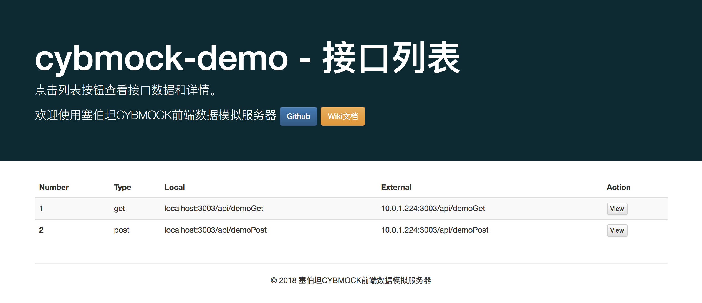

<p align="center">
  <a href="http://cybmock.hestudy.com" target="_blank">
    
  </a>
  <br>
  <br>
  <a href="https://www.npmjs.com/package/cybmock">
  </a>
  <br>
  <br>
  
  
  
  <br>
</p>

<h1 align="center">塞伯坦（CYBMOCK）前端数据模拟服务器</h1>
帮助WEB开发者零配置、快速构建MOCK服务器，模拟服务器返回的对象、数组、以及根据传参变化的各种场景的请求数据。支持MOCK数据的热更新、及使用ES Module模块化组织和维护MOCK数据。支持同时启动多个MOCK服务。

<h2 align="center">安装和使用</h2>

- Mac系统推荐使用 [iterm2](http://iterm2.com/) 及 [oh my zsh](http://ohmyz.sh/)。
- 类 Unix 系统，请打开任意终端输入命令执行。
- Windows 用户请先安装 [git](http://git-scm.com/)，然后在 [Git Bash](http://git-for-windows.github.io/) 下执行命令。

### 安装

**1. 安装 Node 和 NPM**

- 官网下载安装Node: [https://nodejs.org](https://nodejs.org)。
- node >= 6.x，建议使用最新稳定版(LTS)。
- Ubuntu 用户使用 `apt-get` 安装 node 后，安装的程序名叫 `nodejs`，需要软链成 `node`。
- Windows 用户安装完成后需要在 CMD 下确认是否能执行 node 和 npm。

> 设置 `npm config set loglevel=http` 可以查看npm包的下载和安装进度。

**2. 全局安装 CYBMOCK**

```bash
npm install -g cybmock #或者 yarn global add cybmock
```

> 某些window系统若不能正常安装CYBMOCK，请使用管理员身份先安装[windows-build-tools](https://github.com/felixrieseberg/windows-build-tools)。

### 使用

**1. 进入MOCK数据存放目录**

```bash
# 新建目录
mkdir cybmock-demo

# 或者进入已有项目目录
cd project

```

**2. 运行MOCK服务**

```bash
cybmock start
```

在命令执行目录会自动生成`cybmock.config.js`配置文件及mock示例。

```
.
└── cybmock.config.js
```

```
//cybmock.config.js 示例
const proxy = {
  'GET /api/demoGet': {
    tips: '用于演示GET请求',
    name: '塞伯坦前端模块化工程构建工具',
    github: 'https://github.com/jd-cyb/cyb-cli'
  },
  'POST /api/demoPost': {
    tips: '用于演示POST请求',
    name: '塞伯坦前端数据模拟服务器',
    github: 'https://github.com/jd-cyb/cybmock'
  }
}

module.exports = proxy
```

为了便于复杂项目MOCK数据的管理，请在与`cybmock.config.js`同级新建`mock`目录，用于存放更多的MOCK数据模块，并支持使用ES Module或CommonJS的模块化管理MOCK数据。

```
.
├── cybmock.config.js
├── mock
│   ├── demo-get.js
│   └── demo-post.js
├── node_modules
│   └── mockjs
└── package.json


//cybmock.config.js

import demoGet from './mock/demo-get'
import demoPost from './mock/demo-post'
import mockjs from 'mockjs'

const proxy = {
    'GET /api/demoGet': demoGet,
    'POST /api/demoArray': demoPost,
    'GET /api/demoMockjs': mockjs.mock('@string("lower", 5)')
}
module.exports = proxy
```

> CYBMOCK 会自动打开默认浏览器进入MOCK数据服务环境，并罗列出`cybmock.config.js`配置的所有 MOCK接口，`cybmock.config.js`及`mock`目录中任意MOCK数据文件的更改都会自动更新接口，请尽情享用CYBMOCK为你带来高效、愉悦的MOCK服务体验！




<h2 align="center">命令说明</h2>

- **启动MOCK服务器**

```bash
cybmock start
```

> 零配置快速启动MOCK服务器，如果命令执行目录`cybmock.config.js`配置文件不存在，会默认创建`cybmock.config.js`并生成demo数据，同时自动打开默认浏览器进入MOCK数据服务环境，并罗列出`cybmock.config.js`配置的MOCK接口，任何MOCK数据文件的更改都会自动更新接口。

<h2 align="center">升级</h2>

- **使用npm升级**

```
npm update -g cybmock
```

- **使用yarn升级**

```
yarn global upgrade cybmock
```
<h2 align="center">资源链接</h2>

使用文档：[http://cybmock.hestudy.com/docs/](http://cybmock.hestudy.com/docs/)

官方网站：[http://cybmock.hestudy.com/](http://cybmock.hestudy.com/)

塞伯坦CYB：[http://cyb.hestudy.com/](http://cyb.hestudy.com/)

<h2 align="center">License</h2>

[MIT](http://opensource.org/licenses/MIT)

Copyright (c) 2018, [塞伯坦前端小组](https://github.com/jd-cyb)


